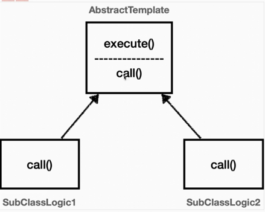
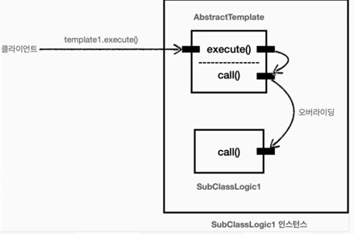

# Template Method Pattern

> '핵심기능'은 해당 객체가 제공하는 고유의 기능이다.  
> '부가기능'은 핵심기능을 보조하기 위한 기능이다. 예를 들어서, 로그 추적기, 트랜잭션 기능이 있다. 단독으로 사용되지 않고, 핵심기능과 함께 사용된다.

**좋은 application은 변화하는 것과 변화하지 않는 것을 분리하는 것이다.**
여기서 핵심기능은 변화하고, 부가기능은 변화하지 않는 코드이다.
이때, 부가기능과 같이 변화하지 않는 것은 템플릿 메서드 패턴을 쓰면 좋다.

## Template Method Pattern이란?

> GOF 디자인 패턴에 따르면, 
> 작업에서 알고리즘을 정의하고 `일부 단계`(변하는 부분)를 하위 클래스로 연기합니다. 템플릿 메서드 패턴을 사용하면,
> 하위 클래스가 구조를 변경하지 않고도 알고리즘의 특정단계를 재정의할 수 있습니다.

**주의점** 
자식클래스가 부모클래스에 강하게 의존합니다. 자식클래스에서 부모클래스의 기능을 사용하던 사용하지 않던
자식 클래스는 부모클래스의 모든 기능을 가지고 있습니다.
예를 들어, 부모클래스의 기능이 바뀌면 모든 자식클래스의 기능이 영향이 받습니다.

=> 이런 상속의 단점을 극복할 수 있는 패턴이 *전략패턴*이다.

템플릿 메서드 패턴은 이름 그대로 템플릿을 사용하는 방식이다. 템플릿은 기준이 되는 틀이다.
템플릿이라는 틀에 변화되지 않는 부분을 몰아둔다. 그리고 변하는 부분은 `call()` 메서드를 호출해서 처리한다. 

템플릿 메서드 패턴은 `부모 클래스`에 `변하지 않는 템플릿 코드`를 둔다.
그리고 `변하는 부분`은 `자식 클래스`에 두고 상속과 오버라이딩을 사용해서 처리한다.

### 익명 내부 클래스 사용하여 적용하기
익명 내부 클래스를 사용하면 객체 인스턴스를 생성하면서 동시에 생성할 클래스를 상속받은 자식 클래스를 정의할 수 있다. 
이 클래스는 SubClassLogic1처럼 직접 지정하는 이름이 없고, 클래스 내부에 선언되는 클래스 이기 때문에 익명 클래스라고 한다.

> *좋은 설계란?*
진정한 좋은 설계는 변경이 자연스럽게 일어날 때 드러난다. 변경되는 코드와 변경되지 않는 코드가 잘 분리가 되어야한다.
(단일책임의 원칙이 잘 지켜진 경우: 변경지점을 한 곳에 모아 변경에 쉽게 대처할 수 있는 구조)
