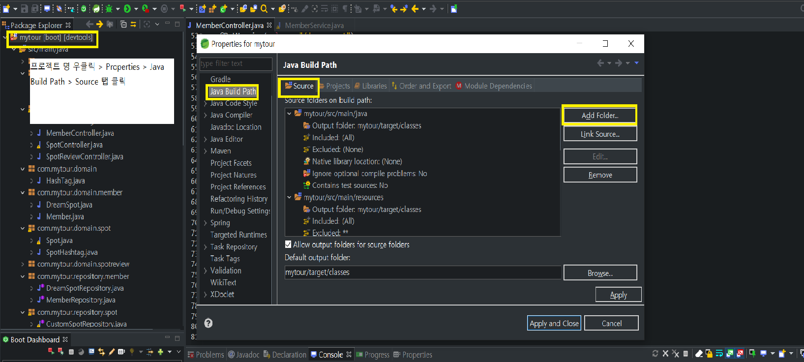
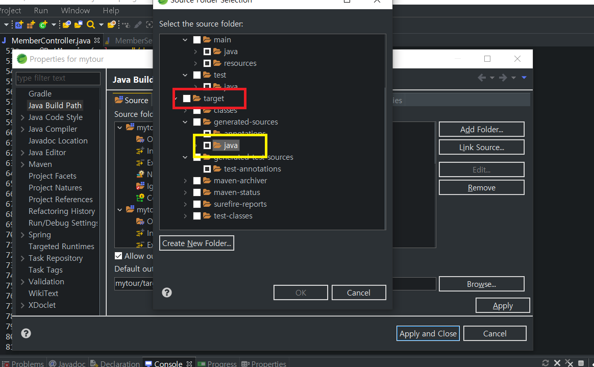

 #  [이슈] QueryDsl 에서 QClass 도메인 접속이 안되는 현상 해결

## 현상

- IDE: STS
- SPRING BOOT
- JPA/QUERYDSl 적용 이후에도, 소스에서 QClass 접속이 안되는 현상
  - Compiler가 QClass를 import 하지 못해 complie error발생

## 해결

- 프로젝트 우클릭 > Properties > Java Build Path > Source 탭 클릭

- `Add Folder` 클릭 > Select the source folder > target 디렉토리 클릭 > generated-source 선택 후 저장

