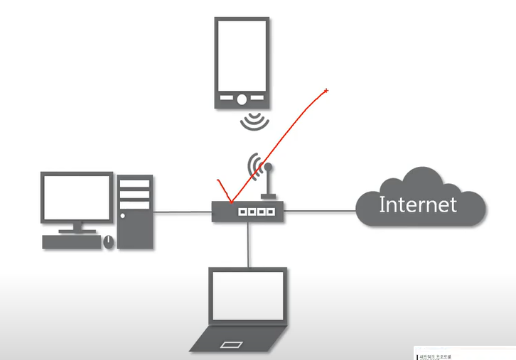
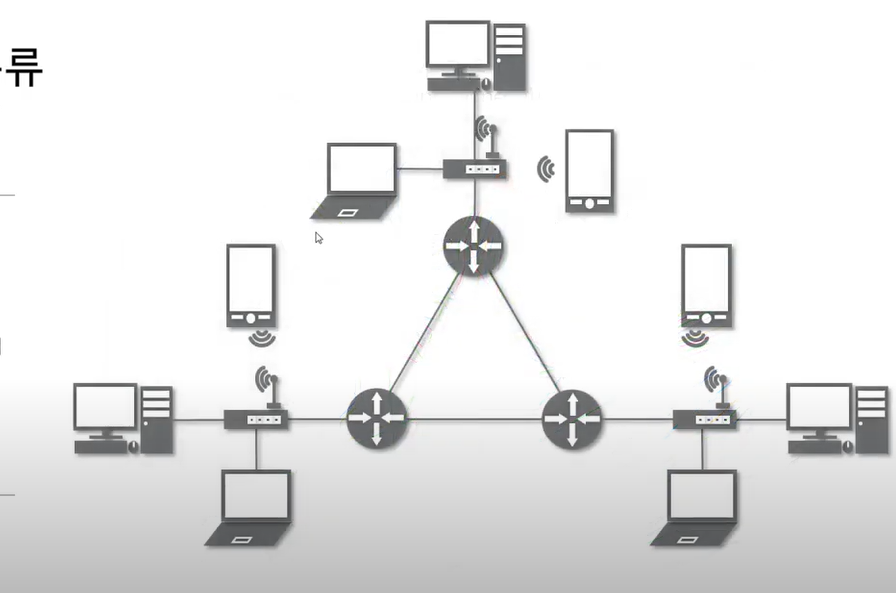

# 01_네트워크란 무엇인가?

노드들이 **데이터를 공유**할 수 있게 하는 디지털 전기통신망의 하나이다.

(*노드: 네트워크에 속한 컴퓨터 및 장비)

네트워크에서 여러장치들은 노드간 연결을 사용하여 서로에게 데이터들을 교환한다

즉, 분산되어 있는 컴퓨터를 통신망으로 연결한 것!


## 인터넷이란?

문서, 그림, 영상과 같은 여러가지 데이터를 공유하도록 구성된 세상에서 가장 큰 전세계를 연결하는 네트워크

**www**는 인터넷을 통해 **웹과 관련된 데이터**를 공유하는 것

> 네트워크 > 인터넷 > www(웹과 관련)


## 네트워크의 분류


### 크기에 따른 분류

1. LAN(Local Area Network) : `가까운 지역`을 하나로 묶은 네트워크(근거리통신망)
   - 예를 들어서, 스타크래프트를 하려면 같은 PC방이어야  LAN으로 친구와 게임할 수 있다
2. WAN(Wide Area Network) : 멀리 있는 지역을 한데 묶은 네트워크. 가까운 지역끼리 묶인 LAN, LAN을 다시 하나로 묶은 것


### 연결형태에 따른 분류

-  STAR형: 중앙 장비에 모든 노드가 연결된 형태(선형)

  

  - 예를들어, 일반적으로 가정집의 공유기
  - 단점: 중앙에 있는 장비가 고장나면 해당 장비에 연결된 모든 장비들이 네트워크 연결이 안됨

- MESH형 : 여러 노드들이 서로 그물처럼 연결된 mesh형

  - 장점: 한 장비가 고장나도 다른 장비에 연결된 장비들끼지 네트워크 연결이 됨
  - 주로 장거리에 있는 곳과 네트워크 연결을 할때 사용함(예를들어, 인터넷이 이렇게 연결되어 있음)

- **혼합형**: 실제 인터넷은 여러 형태를 혼합한 형태

  




## 네트워크의 통신방식


### 네트워크에서 데이터는 어떻게 주고받는가?

1. 유니캐스트: 특정한 대상이랑만 1:1로 통신
2. 멀티캐스트: 1:N 특정한 다수랑만 통신
3. 브로드캐스트: 같은 네트워크대역에 있는 **모든** 사용자와 통신


## 네트워크 프로토콜

### 프로토콜이란?

> 프로토콜은 일종의 약속, 양식
>
> `네트워크에서 노드와 노드가 통신할 때 어떤 노드가 어느 노드에게 어떤 데이터를 어떻게 보내는지 작성하기 위한 양식`
> 예) 택배는 택배만의 양식
>	편지는 편지만의 양식
>	전화는 전화만의 양식
>**프로토콜도 각 프로토콜만의 양식이 있다**	


### 여러가지 프로토콜

- 가까운 곳과 연락할때: Ethernet, MAC주소
- 멀리있는 곳과 연락할때: IPv4, ICMP, ARP(IP주소)
- 여러가지 프로그램으로 연락할때: TCP, UDP(포트번호)

```
여러 프로토콜들로 캡슐화된 패킷
Ethernet|IPv4|TCP|Data
```


## 실습 1

`tracert 8.8.8.8`

dns.google로 가는 경로 추적


의미: 우리집 컴퓨터에서 구글 DNS까지 도달하는데 거쳐가는 네트워크 대역폭

번외) 가장 가까운 192.168.0.1은 IPTIME이다...

## 실습 2

wireshark 설치